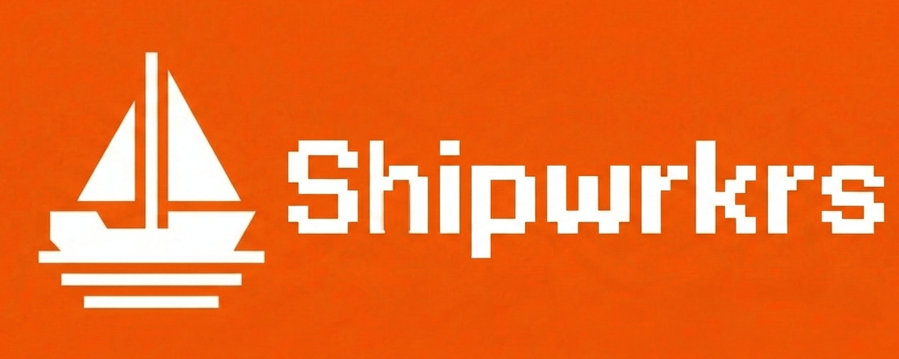

# shipwrkrs.dev



Describe a Worker in plain English, generate code, review it, and deploy from one app.

## What this app does

- Sign in with Cloudflare
- Generate Worker code from a prompt (free tier: Workers AI, premium: Anthropic)
- Edit code in a live CodeMirror editor
- Deploy to `workers.dev`
- **Track deploy history with Cloudflare Artifacts** — every deploy is versioned
- **Diff view** — see what changed when re-deploying existing Workers
- **Clone Workers** — get a git URL to clone any deployed Worker

## Stack

- Vue 3 + Vite + Bun frontend
- Single Cloudflare Worker serving UI + API
- Cloudflare D1 for users, limits, and deploy history
- Workers AI (free tier) + optional Anthropic key (premium tier)
- **Cloudflare Artifacts for versioned code storage**

## Quick start (local)

1. Install dependencies

```bash
bun install
```

2. Run both frontend and API dev servers

```bash
bun run dev
```

This starts:
- Wrangler dev server on port 8788 (API)
- Vite dev server on port 5173 (frontend with proxy)

Then open http://localhost:5173

### Alternative: run separately

```bash
# Terminal 1: API only
bun run dev:api

# Terminal 2: Frontend only
bun run dev:frontend
```

## Database setup

Apply local migrations:

```bash
bun run db:migrate
```

Apply remote migrations (before production deploy):

```bash
wrangler d1 migrations apply shipwrkrs-db --remote
```

## Configuration

Set these secrets/vars in your Worker environment.

Required:

- `SESSION_SECRET`
- `AUTH_ENCRYPTION_KEY` (base64url 32-byte key)

Choose one auth path:

- OAuth flow:
  - `CF_OAUTH_CLIENT_ID`
  - `CF_OAUTH_CLIENT_SECRET`
  - `CF_OAUTH_REDIRECT_URI`
- Server token fallback:
  - `CF_DEPLOY_API_TOKEN`
  - `CF_DEPLOY_ACCOUNT_ID` (optional, auto-resolved when possible)

Optional:

- `ANTHROPIC_API_KEY` (premium generation tier)
- **Artifacts binding** (for versioned deploys — only works in production, not local dev)

## Cloudflare Artifacts Integration

shipwrkrs now uses Cloudflare Artifacts as a versioned code storage layer:

- Every deploy commits the Worker code to an Artifact repo named after the script
- Commit message: `Deploy via shipwrkrs — {timestamp}`
- Deploy history shows Artifact commit SHAs
- Re-deploys show a diff view comparing previous vs new code
- Users can clone any deployed Worker via a short-lived read token (1 hour expiry)

### Artifacts configuration (production only)

Add to `wrangler.toml` for production:

```toml
[[artifacts]]
binding = "ARTIFACTS"
namespace = "default"
```

Note: Artifacts binding is commented out in local dev because it's not supported by wrangler dev.

## Mock mode

Mock mode is controlled in `wrangler.toml`:

```toml
[vars]
MOCK_MODE = "false"
```

Set it to `"true"` to test full UI flow with mock auth/generate/deploy responses.

## Deploy

```bash
bun run deploy
```

Equivalent manual deploy:

```bash
bun run build
wrangler deploy
```

## Project structure

```
functions/api/        # API routes (Cloudflare Pages Functions)
  auth/             # Login, callback, logout, me
  generate.ts       # AI code generation
  deploy.ts         # Worker deployment
  history.ts        # Deploy history
  limits.ts         # Usage limits
  artifacts/        # Artifacts integration
    code.ts         # Fetch code from Artifact commit
    diff.ts         # Get previous code for diffing
    token.ts        # Mint read tokens for clone URLs
src/                  # Vue frontend
  components/       # UI components
    CloneSection.vue    # Clone Worker button/modal
    DiffViewer.vue      # Unified/split diff view
    CodeEditor.vue      # CodeMirror editor
  views/            # Page views
    Describe.vue    # Prompt input
    Review.vue      # Code review + deploy
    History.vue     # Deploy history
    Success.vue     # Deploy success
migrations/           # D1 SQL migrations
  0001_init.sql
  0002_deploy_secret_names.sql
  0003_artifacts.sql
```
